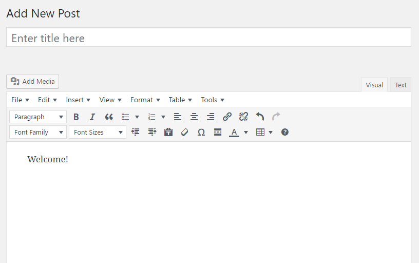

# Enriched Editor

> The **Enriched Editor** plugin adds lots of additional options to the ClassicPress visual editor. This plugin is a fork of TinyMCE Advanced for WordPress and contains no Gutenberg code.

### Pre-Installation
If you already have _TinyMCE Advanced_ or _WYWIWYG Advanced_ installed, you will need to deactivate and delete before installing _Enriched Editor_. If you want to preserve your current editor settings, you can export them to a text file before deleting the current plugin. You can then import those settings back into Enriched Editor after you get it installed.

### Editor Options
* **Enable Editor for Primary Screens**
  Enable the Enriched Editor for primary editing screens, including those for _posts_, _pages_, and _custom post types_.
* **Enable Editor for Secondary Areas**
  Enable the Enriched Editor for secondary editing areas, including those for _text widgets_ and other _textarea inputs_.
* **Enable Editor for Public Use**
  Enable the Enriched Editor for public use, such as in _user comments_ and other _textarea inputs_.
* **Advanced Menu**
  Enable the advanced menu (_File_, _Edit_, _Insert_, _View_, _Format_, _Table_, and _Tools_) for the first row.
* **Enhanced Lists**
  Enable advanced list options, including upper-case, lower-case, disk, square, circle, etc.
* **Right-Click**
  Enable link insertion by right-clicking the editor.
* **Simplified Links**
  Use a simplified dialog for creating links.
* **Font Sizing**
  Use pixels (instead of points) for font sizes.
* **Preserve Paragraphs**
  Preserve &lt;p&gt; and &lt;br&gt; tags without replacing them.
* **Custom Style Menu**
  Pull custom styles from an `editor-style.css` file and add them to a drop-down menu.

